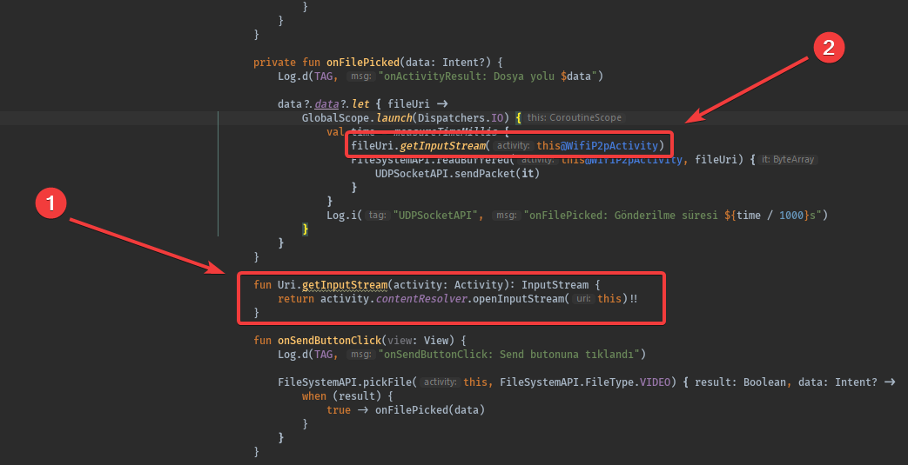

# 💠 Fonksiyonlar

## ➕ Function Extension

* ➕ Olmayan metotları sınıflara sonradan dahil edebilirsiniz
* 💁‍♂️ Tanımlı olan sınıflara `.` operatörü ile metotlar ekleyebilirsiniz
* 🐥 Metot yerine `get() =` yapısı ile property \(özellik\) de eklenebilir
* 👇 Alttaki örneklerde `Uri` ve `WifiP2pInfo` sınıfına metodu ve özellik ekliyoruz



```kotlin
// Metot genişletmeleri
fun Uri.getInputStream(activity: Activity): InputStream {
    return activity.contentResolver.openInputStream(this)!!
}

val activity = Activity()
val mUri: Uri = new Uri()

// Kullanım
val inputStream = uri.inputStream(activity)
```

```kotlin
// Özellik genişletmeleri
val WifiP2pInfo.isConnected: Boolean
    get() = groupFormed

val WifiP2pInfo.isClient: Boolean
    get() = isConnected && !isGroupOwner

val WifiP2pInfo.isServer: Boolean
    get() = isConnected && isGroupOwner
    
val info: WifiP2pInfo = WifiP2pInfo()

// Kullanımlar
info.isConnected
info.isClient
info.isServer
```


📢 `Uri` ve `WifiP2pInfo` sınıfı temel java sınıflarından birisidir


