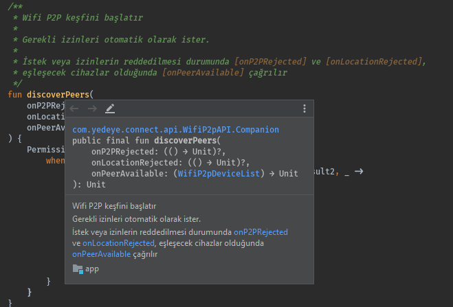
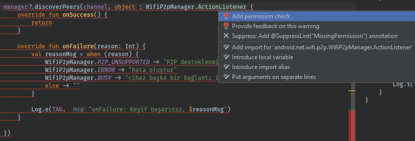

# 🚀 Kotlin'in Java'ya Göre Avantajları \(Kotlin vs Java\)

## ✨ Değişken Tanımlaması

* 💦 Java'daki `final` yapısı yerine daha sade bir arayüz sunar
* 🚀 Değişken türlerinin tanımlanmasına gerek yoktur
* 😱 Fonksiyon değişkenleri tanımlanabilir
* ⚡ Statik değişkenler için scope sunar
* 🕐 Daha sonra tanımlanacak değişkenler oluşturulabilir \(`lateinit`\)

> 🧐 Size birini mi anımsattı? \([🐍 Python](https://python.yemreak.com)\)

```kotlin
var metin = "yemreak" // String metin = "yemreak"
var metin: String = "yemreak" // String metin = "yemraek"
val metin = "değişmem" // final String metin = "değişmem"

/*
Foo
bar
*/
val uzunMetin = """
                Foo
                Bar
                """.trimIndent()

/*
if(a > 1) {
    return a
}
*/               
val uzunGirintiliMetin = """if(a > 1) {
                         |    return a
                         |}""".trimMargin()

var func: () -> Unit = {
    // Kardeş ben fonksiyonum
}

var func2: (Boolean) -> Unit = { bool ->
    // Kardeş ben parametreli fonksiyonum
}

var func2: (Boolean) -> Int = { bool ->
    // Kardeş ben bir integer döndürüyorum
    return 1
}

companion object {
    var metin = "yemreak" // static String metin = "yemreak"
    var metin: String = "yemreak" // static String metin = "yemraek"
    val metin = "değişmem" // static final String metin = "değişmem"
}

lateinit var sonrakiMetin
// ... 
sonrakiMetin = "yok"

// 0 sa true değilse false
val isEmpty: Boolean get() = size == 0
```

## 🐥 Nullable Objeler

* ✨ Java'daki `NullPointerException` hatalarına odaklı bir çalışmadır
* 🌌 Objeler null olabilir veya null olamaz şeklinde oluşturulur
* 💁‍♂️ Default olarak null olamaz olarak atanır

```kotlin
var metin: String = "selam" // var metin = "selam" ile aynıdır
var metin: String? = null
metin?. // Varsa kullan
metin!! // Olduğundan kesinlikle eminim

var func: (() -> Unit)? = null
func?.invoke() // Null değilse çalıştır

// Dsoya varsa sayısı yoksa boş yaz
println(files?.size ?: "empty")

// Hata fırlatmalı atamalar
val email = values["email"] ?: throw IllegalStateException("Email is missing!")
```

## 🐣 Get Set Kullanımı

* 🌌 Get set olmadan direkt olarak kullanabilirsiniz
* ‍🧙‍♂ Kotlin, onu sizin için halletmekte

```kotlin
val arrayAdapter = ArrayAdapter<String>(
    wifiDirectActivity,
    R.layout.activity_wifi_direct,
    deviceNameList
)
wifiDirectActivity.lvPeer.adapter = arrayAdapter
```

## 👮‍♂️ Switch - Case

* 🤝 Koşullu değer atama işlemlerini destekler
* 📈 Sıradan switch yapısına göre daha verimlidir

```kotlin
val reasonMsg = when (reason) {
    WifiP2pManager.P2P_UNSUPPORTED -> "P2P desteklenmiyor"
    WifiP2pManager.ERROR -> "hata oluştur"
    WifiP2pManager.BUSY -> "cihaz başka bir bağlantı ile meşgul"
    else -> ""
}
```

## 💁‍♂️ Functional Arguments

* 💦 Gereksiz yere parantez `(` kullanımı yoktur
* ⚙️ Bu yapı ile otomatik olarak **son fonksiyona** tanımlanan işlemler atanır

```kotlin
button.setOnClickListener { view ->
    // ...
}

/*
// Java kullanımı
button.setOnClickListener ( { view ->

});
*/

fun funcT(func1: () -> Unit, func2 () -> Unit) { }

funcT({ /* func1 */ }) {
    // func2
}
```


📢 Functional argument olursa, sadece `metot {}` kullanılması durumunda sadece son argümana değer atanır


## 👨‍💼 Run - Apply - Let - Also

* 👪 Bir değişkenin birden fazla metodunu kullanmayı sağar
* 🐣 Apply objelerine değer atarsınız
* ▶️ Run ile alt metotlarını kullanırsın, sonucunu döndürürsünüz
* 🙋‍♂️ Let ile objeyi koşullu kullanabilirsin
* 💁‍♂️ Also ile "işlemi bitirmeden bir de bunu yap" deriz
* 📈 Tekrar tekrar yazmayı engeller

```kotlin
val wifiFilter = IntentFilter().apply {
    addAction(WifiP2pManager.WIFI_P2P_STATE_CHANGED_ACTION)
    addAction(WifiP2pManager.WIFI_P2P_PEERS_CHANGED_ACTION)
}

obje.run {
    metot2() // obje.metot2()
    metot3() // obje.metot3() Döndürülür
}

obje?.let { // Koşullu kullanım
    it.metot2() // obje.metot2()
    it.metot3() // obje.metot3()
}

channel?.also { channel ->
    wifiReceiver = WifiDirectBroadcastReceiver(manager, channel, this)
}

// Yer değiştirme
a = b.also { b = a }
```


‍🧙‍♂ Detaylı bilgi için [Scope Function](https://kotlinlang.org/docs/reference/scope-functions.html#functions) ve [Function Selections](https://kotlinlang.org/docs/reference/scope-functions.html#functions) alanlarına bakabilirsin.


## 👀 Dokümantasyon Linkleri

* 👇 Metotların üzerine geldiğinizde \(hover\) açıklamasında doküman linki olur
* ⭐ Link üzerinden kullanım örneklerine erişirsiniz



## 👮‍♂️ İzinlerin Kontrolü

* 📢 İzin tanımlanmadığında hata verir
* 💁‍♂️ `@SupressLint("MissingPermission")` ile bunu engelleyebilirsiniz
* 🤭 "Ne yaptığımın farkındayım, bana bulaşma" demek gibi



## 🔪 Dizileri Parçalama

* 🎯 Range metodu kullanılarak diziler parçalanabilmekte
* 🐥 Çok kolay kullanımı vardır

> 🐍 Python dizi parçalama işlemlerine benzemektedir

```kotlin
val byteArray = ByteArray()

byteArray.slice(0..1)

val bas = 10
val son = 100
byteArray.slice(bas..son)
```

## 💎 Keyword Argument

* ✨ Değişkenlerin adları ile onlara değer atayabilirsin
* ⭐ Python gibi dillerde olan bir kullanımdır

```kotlin
hasWifiDirectPermission(activity = activity)

fun hasWifiDirectPermission(activity: Activity): Boolean {
    return hasPermission(
        activity,
        Manifest.permission.ACCESS_FINE_LOCATION
    )
}
```


📢 Functional argument olursa, sadece `metot {}` kullanılması durumunda sadece son argümana değer atanır


## 💠 Parametre Olarak Fonksiyon

* 💁‍♂️ Fonksiyonlar obje ise parametre olarak da kullanılabilir
* 💡 [Tanımlama şekli](kotlin-vs-java.md#degisken-tanimlamasi) ile parametre olarak verilebilir

```kotlin
fun func(inFunc: (ByteArray) -> Unit) {
   // ...
   inFunc()
}

// Func kullanımı
func {
   // inFunc içeriği
]

var func2 = { byteArray -> /* ... */ }
func(func2) 

```

## 🚧 Threading

* 🕊️ Thread işlemlerini kolaylaştıran bir hafif yapıdır
* 👷‍♂️ `Coroutine` ile inline thread kullanabilirsin
* 👮‍♂️ Main \(UI\), IO, Default thread yapıları ile arka plan işlemlerini yönetirsiniz
* ✨ Otomatik olarak optimize edilirler

| 🧱 Dispatchers.Main | 🔣 Dispatchers.IO | 🎳 Dispatchers.Default |
| :--- | :--- | :--- |
| UI Thread işlemleri | Disk ve network işlemleri | CPU gerektiren işlemler |
| Fonksiyon çağırma | Database | Liste sıralama |
| View işlemleri | Dosya okuma & yazma | JSON parsing |
| LiveData işlemleri | Ağ işlemleri | DiffUtils |

## 🧐 Daha Fazla



{% embed url="https://medium.com/@yedhrab/kotlinin-java-ya-g%C3%B6re-avantajlar%C4%B1-3e88ab5620bf" %}

