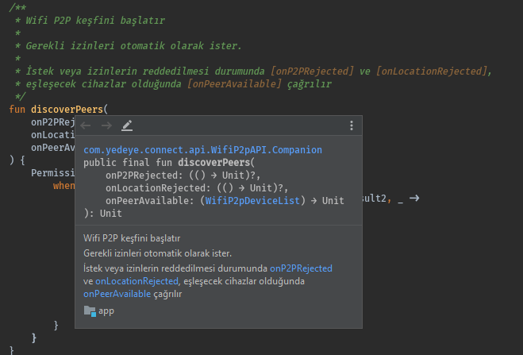

# 📑 Yazım Kuralları

## 🤵 Adlandırmalar

```kotlin
// Test için özel adlandırmalar
class MyTestCase {
     @Test fun `ensure everything works`() { /*...*/ }
     
     @Test fun ensureEverythingWorks_onAndroid() { /*...*/ }
}

// Property
val isEmpty: Boolean get() = size == 0
```

## 👮‍♂️ Koşul Kullanımları

```kotlin
when (foo) {
    true -> bar() // good
    false -> { baz() } // bad
    else -> {}
}

// 2 değişken için if öneriliyor
if (x == null) /* ... */ else /* ... */
```

## ⛓️ Zincir Kullanımlar

* 👆 `?` başta olur

```kotlin
val anchor = owner
    ?.firstChild!!
    .siblings(forward = true)
    .dropWhile { it is PsiComment || it is PsiWhiteSpace }
```

## 🚄 Keyword Sırası

```kotlin
public / protected / private / internal
expect / actual
final / open / abstract / sealed / const
external
override
lateinit
tailrec
vararg
suspend
inner
enum / annotation
companion
inline
infix
operator
data
```

## 📜 Kotlin Doc



```kotlin
// Avoid doing this:

/**
 * Returns the absolute value of the given number.
 * @param number The number to return the absolute value for.
 * @return The absolute value.
 */
fun abs(number: Int) { /*...*/ }

// Do this instead:

/**
 * Returns the absolute value of the given [number].
 */
fun abs(number: Int) { /*...*/ }
```

## 🏗️ Function Builder

* 👮‍♂️ `from<Name>` adı tercih edilmeli
* ⭐ `fromPolar` 

```kotlin
class Point(val x: Double, val y: Double) {
    companion object {
        fun fromPolar(angle: Double, radius: Double) = Point(...)
    }
}
```

## 🧐 Kaynaklar



